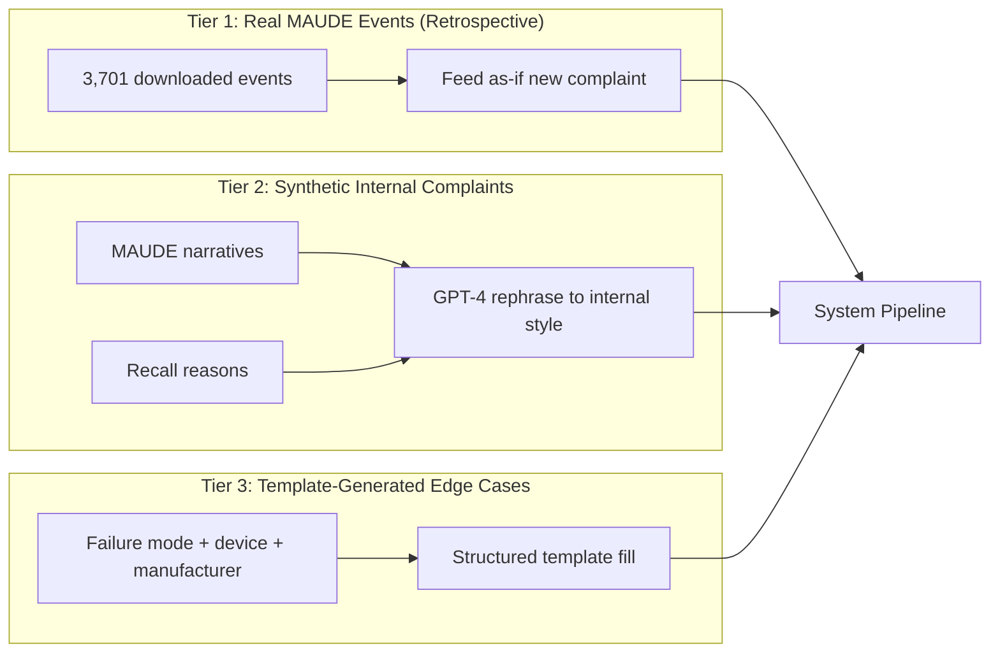
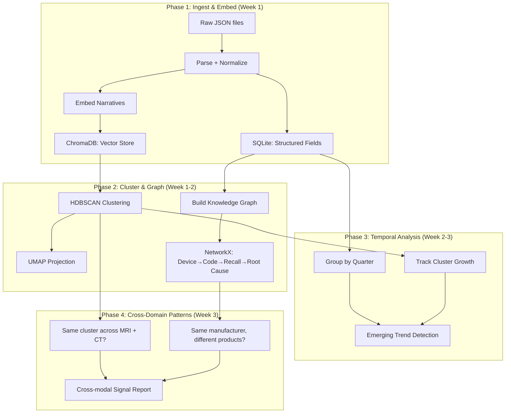
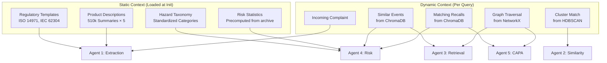

# System Design Deep Dive: Data Architecture, Simulation & Regulatory Context

> Companion to [System_Design.md](../System_Design.md)  
> Answers: Risk data needs, complaint simulation, archive analysis, database choices, and product-level regulatory context catalogue

---

## 1. DO WE NEED RISK DATA? — Yes, But Not What You Think

### What "Risk Data" Means in This System

| Layer | What It Is | Where It Comes From | Why We Need It |
|-------|-----------|---------------------|----------------|
| **Severity ground truth** | How bad was the outcome? | MAUDE `event_type` field: Death/Injury/Malfunction | Agent 4 (Risk) needs calibration |
| **Probability estimation** | How often does this happen? | Count of similar events in our cluster | Agent 4 frequency-based reasoning |
| **Risk classification** | Class I/II/III recall | Recall `classification` field (already in our 3,299 recalls) | Regulatory context for risk level |
| **Root cause → risk mapping** | "Software design" → what severity? | Cross-reference root_cause with event_type across recalls | Train risk agent to associate cause→severity |
| **Product risk class** | Is this device Class I, II, or III? | FDA device classification database (`device_class` field) | Context for Agent 4 decision threshold |
| **Hazard taxonomy** | Standard hazard categories (ISO 14971) | OpenRegulatory templates + FDA guidance | Structured output vocabulary for Agent 4 |

### Risk Data We ALREADY Have (No Additional Download Needed)

```python
# From our 3,299 recalls:
recall["classification"]      # "Class I" (most serious), "Class II", "Class III"
recall["root_cause_description"]  # "Software design", "Device Design", etc.
recall["event_type"]          # Maps to severity context

# From our 3,701 events:
event["event_type"]           # "Death", "Injury", "Malfunction"
event["product_problems"]     # Lists of failure modes
event["patient"]              # Age, weight, outcome codes

# We can COMPUTE:
# severity_distribution[product_code][failure_mode] → {Death: 2, Injury: 15, Malfunction: 200}
# This IS your risk probability matrix
```

### Risk Data We NEED to Create (Week 1 Task)

| Artifact | What | How | Owner |
|----------|------|-----|-------|
| **Severity Scale** | 5-level mapping from FDA data to ISO 14971 | Map event_type + patient outcome → S1-S5 | M5 |
| **Probability Scale** | 5-level from occurrence frequency | Define: Frequent (>100/yr), Probable (10-100), Occasional (1-10), Remote (<1), Improbable (0) | M5 |
| **Risk Matrix** | 5x5 severity × probability | Standard ISO 14971 matrix, pre-populated from our data | M5 |
| **Hazard Categories** | Standard list for imaging software | From OpenRegulatory templates + our product_problems | M3 |

### The Key Insight: We Don't Need External Risk Documents Per Se

Our 3,299 recalls with `root_cause_description` + `classification` + our events with `event_type` together **constitute** a risk database. The system learns:

- "Software design" root cause → 32.6% of recalls → mix of Class I (15%) and Class II (85%)
- "Image artifact" problem → usually Malfunction (no injury) → Low-Medium risk
- "False negative result" → may lead to missed diagnosis → potentially Serious

**Agent 4 doesn't need an ISO 14971 risk file to read — it needs the statistical distribution from real outcomes, which we already have.**

---

## 2. HOW DO WE SIMULATE INCOMING COMPLAINTS?

### Three-Tier Input Strategy



### Tier 1: Retrospective Mode (Primary — Week 1-2)

**Concept**: Take real MAUDE events, pretend they just arrived as internal complaints.

```python
# Simulation approach:
def simulate_incoming_complaint(maude_event):
    """Convert a MAUDE event into a simulated internal complaint."""
    # Extract just the narrative — this is what a QM would paste in
    narratives = [text["text"] for text in maude_event.get("mdr_text", [])]
    complaint_text = " ".join(narratives)
    
    # The system processes this WITHOUT seeing the structured fields
    # (those become ground truth for evaluation)
    return {
        "complaint_id": f"SIM-{maude_event['report_number']}",
        "submitted_by": "Quality Engineer",
        "date_received": datetime.now().isoformat(),
        "raw_text": complaint_text,
        "device_family": "Unknown",  # System must infer
        # Hidden ground truth (for evaluation only):
        "_ground_truth": {
            "event_type": maude_event.get("event_type"),
            "product_problems": maude_event.get("product_problems", []),
            "manufacturer": maude_event["device"][0].get("manufacturer_d_name"),
            "product_code": maude_event["device"][0].get("device_report_product_code"),
        }
    }
```

**Why This Works**: The narrative IS the complaint. Real QMs would get something very similar — a text description of what happened. The structured fields become ground truth for evaluating Agent 1's extraction accuracy.

### Tier 2: Synthetic Internal Complaints (Week 1, Day 3-4)

**Concept**: Use GPT-4 to rephrase MAUDE narratives into internal complaint style.

```python
REPHRASE_PROMPT = """You are a medical device quality engineer writing an internal 
complaint report. Rephrase this FDA adverse event narrative into the style of an 
internal complaint form submission. 

Rules:
- Use first-person or third-person internal perspective ("Our field service team reported...")
- Remove FDA-specific language (MDR, report number references)
- Keep all technical details (device model, failure mode, patient impact)
- Add plausible internal context (which hospital, which service visit, ticket number)
- Keep the SAME failure mode and severity — do not invent new problems
- Length: 100-300 words

FDA Narrative:
{narrative}

Device: {device_model}
Manufacturer: {manufacturer}

Internal Complaint Report:"""
```

**Generate 200 synthetic complaints** covering:
- 80 MRI (thermal burns, image artifacts, software crashes, coil failures)
- 50 CT (dose errors, reconstruction failures, motion artifacts)
- 40 Ultrasound (probe failures, DICOM errors, display issues)
- 30 Molecular Dx (false results, reagent errors, software failures)

### Tier 3: Template Edge Cases (Week 2)

**Concept**: Stress-test the system with controlled variations.

```python
TEMPLATES = [
    # Ambiguous severity
    "Patient reported {symptom} during {procedure} on {device}. Clinical team "
    "noted {observation}. Patient was {outcome}. Device serial: {serial}.",
    
    # Multi-device interaction
    "During integration of {device_1} with {device_2} via DICOM, {failure} occurred. "
    "Images from {device_1} were {image_status} when viewed on {device_2}.",
    
    # Emerging signal (new failure mode)
    "Third report this month of {novel_failure} on {device} running SW {version}. "
    "Previous two incidents at {hospital_1} and {hospital_2}. This one at {hospital_3}.",
    
    # Competitor intelligence
    "Customer called regarding competitor device ({competitor_device}) showing "
    "similar {failure_mode} as our product. Wants to know if this is industry-wide.",
]
```

### Batch vs. Real-Time Simulation

| Mode | Use Case | Implementation |
|------|----------|----------------|
| **Retrospective batch** | Process all 3,701 events through pipeline | Evaluate system quality at scale |
| **Single complaint** | Demo: paste one narrative, get signal report | Primary demo scenario |
| **Streaming simulation** | Feed events chronologically (by date_received) | Test temporal anomaly detection |
| **Inject + watch** | Add synthetic event to existing cluster | Test if system detects signal growth |

---

## 3. HOW DO WE ANALYSE ARCHIVE DATA?

### Archive Analysis Pipeline



### What "Archive Analysis" Actually Means

| Analysis Type | Question Being Answered | Method | Output |
|---------------|------------------------|--------|--------|
| **Failure mode frequency** | "What breaks most often?" | Count product_problems by device | Bar chart + ranked table |
| **Temporal trending** | "Is this problem getting worse?" | Events per quarter per cluster | Time series + anomaly flag |
| **Cross-product correlation** | "Does MRI artifact = CT artifact?" | Compare embeddings across codes | Similarity score, shared cluster |
| **Manufacturer benchmarking** | "Does Philips have more SW issues than Siemens?" | Normalize by market share (proxy: event count) | Comparative risk profile |
| **Recall prediction** | "Does this event pattern match pre-recall signals?" | Compare current cluster to historical recall timeline | Predictive alert |
| **Root cause pattern mining** | "What root causes lead to Class I recalls?" | Recall root_cause × classification cross-tab | Decision support for Agent 4 |

### Implementation: Archive Analysis Script

```python
class ArchiveAnalyzer:
    """Batch analysis over entire historical dataset."""
    
    def __init__(self, db_path: str, vector_store_path: str, graph_path: str):
        self.db = sqlite3.connect(db_path)
        self.vectors = chromadb.PersistentClient(path=vector_store_path)
        self.graph = nx.read_graphml(graph_path)
    
    def temporal_analysis(self, product_code: str, window: str = "quarter"):
        """Detect trends in event frequency over time."""
        # Group events by time window
        # Calculate rate of change
        # Flag if growth > 2σ above mean
        pass
    
    def cross_domain_clusters(self):
        """Find failure patterns that span multiple device types."""
        # Cluster all embeddings regardless of product code
        # Identify clusters containing events from ≥2 product codes
        # These are "cross-modal signals" — high research value
        pass
    
    def pre_recall_signal_detection(self):
        """Retrospective: Did event patterns precede recalls?"""
        # For each recall in our 3,299:
        #   1. Find the recall date
        #   2. Look at events 6-12 months BEFORE recall
        #   3. Was there a cluster growth spike?
        # If yes → validates our temporal detection approach
        pass
    
    def manufacturer_risk_profile(self, manufacturer: str):
        """Build complete risk profile for a manufacturer."""
        # All events + all recalls for this manufacturer
        # Root cause distribution
        # Severity distribution
        # Product codes affected
        # Timeline of issues
        pass
```

---

## 4. DATABASE ARCHITECTURE: What to Use and Why

### The Three-Store Pattern

```
┌─────────────────────────────────────────────────────────┐
│                    Application Layer                      │
│  (LangGraph Agents, Streamlit Dashboard, API)           │
├─────────────┬───────────────────┬───────────────────────┤
│  SQLite     │   ChromaDB        │   NetworkX            │
│  (Structured│   (Vector Store)  │   (Knowledge Graph)   │
│   Metadata) │                   │                       │
├─────────────┼───────────────────┼───────────────────────┤
│ • report_id │ • narrative embed │ • Device nodes        │
│ • date      │ • recall embed    │ • ProductCode nodes   │
│ • device    │ • cluster_id      │ • Recall nodes        │
│ • mfr       │ • similarity      │ • RootCause nodes     │
│ • event_type│ • retrieval       │ • Manufacturer nodes  │
│ • problems  │                   │ • has_code edges      │
│ • product_  │                   │ • has_recall edges    │
│   code      │                   │ • made_by edges       │
└─────────────┴───────────────────┴───────────────────────┘
```

### Database Comparison (Why These Three)

| Option | Type | Capacity | Pros | Cons | Verdict |
|--------|------|----------|------|------|---------|
| **SQLite** | Relational | Millions of rows | Zero config, portable, fast for 20K records, SQL joins, supports FTS5 | No concurrent writes, single machine | ✅ Use for structured metadata |
| **ChromaDB** | Vector | Millions of vectors | Simple API, persistent, metadata filtering, good for retrieval | Less mature than Pinecone/Weaviate | ✅ Use for embeddings + RAG |
| **NetworkX** | Graph (in-memory) | ~100K nodes | Pure Python, no server, good for small graphs, fast traversal | In-memory only, no persistence built-in | ✅ Use for knowledge graph |
| PostgreSQL + pgvector | Relational + Vector | Unlimited | Production-grade, single DB for everything | Overkill for 20K records, needs server setup | ❌ Too heavy |
| Neo4j | Graph DB | Millions of nodes | Cypher queries, production graph DB | Docker setup, licensing, overkill for 3K nodes | ❌ Too heavy |
| Pinecone/Weaviate | Cloud vector | Billions | Scalable, managed | Needs internet, costs money, vendor lock-in | ❌ Unnecessary |
| DuckDB | Analytics | Billions of rows | Fast analytics, columnar | Not needed — we're not doing OLAP | ❌ Wrong use case |

### Schema Design

#### SQLite: `signal_intelligence.db`

```sql
-- Core event table (parsed from JSON)
CREATE TABLE events (
    id INTEGER PRIMARY KEY,
    report_number TEXT UNIQUE NOT NULL,
    date_received DATE,
    event_type TEXT,  -- 'Death', 'Injury', 'Malfunction'
    product_code TEXT NOT NULL,
    device_name TEXT,
    manufacturer TEXT,
    manufacturer_normalized TEXT,  -- After entity resolution
    brand_name TEXT,
    narrative TEXT,
    narrative_length INTEGER,
    domain TEXT,  -- 'imaging' or 'molecular_dx'
    modality TEXT,  -- 'MRI', 'CT', 'Ultrasound', 'X-ray', 'Hematology', 'PCR', 'MolDx'
    software_related BOOLEAN,
    cluster_id INTEGER,
    embedding_id TEXT,  -- Reference to ChromaDB
    created_at TIMESTAMP DEFAULT CURRENT_TIMESTAMP
);

-- Product problems (many-to-many)
CREATE TABLE event_problems (
    event_id INTEGER REFERENCES events(id),
    problem_code TEXT NOT NULL,
    PRIMARY KEY (event_id, problem_code)
);

-- Recalls table
CREATE TABLE recalls (
    id INTEGER PRIMARY KEY,
    recall_number TEXT UNIQUE,
    product_code TEXT NOT NULL,
    reason_for_recall TEXT,
    root_cause TEXT,
    classification TEXT,  -- 'Class I', 'Class II', 'Class III'
    action TEXT,
    recalling_firm TEXT,
    manufacturer_normalized TEXT,
    recall_date DATE,
    software_related BOOLEAN,
    embedding_id TEXT
);

-- Clusters (from HDBSCAN)
CREATE TABLE clusters (
    id INTEGER PRIMARY KEY,
    label TEXT,
    size INTEGER,
    first_seen DATE,
    last_event_date DATE,
    growth_rate_30d REAL,
    dominant_problem TEXT,
    dominant_modality TEXT,
    trend_flag TEXT  -- 'emerging', 'stable', 'declining'
);

-- Risk lookup (precomputed from archive analysis)
CREATE TABLE risk_statistics (
    product_code TEXT,
    problem_code TEXT,
    total_events INTEGER,
    deaths INTEGER,
    injuries INTEGER,
    malfunctions INTEGER,
    recall_count INTEGER,
    avg_severity REAL,  -- Computed from outcomes
    PRIMARY KEY (product_code, problem_code)
);

-- Processing log (for incoming complaints)
CREATE TABLE signal_reports (
    id INTEGER PRIMARY KEY,
    complaint_text TEXT,
    extraction_json TEXT,  -- Agent 1 output
    cluster_match INTEGER REFERENCES clusters(id),
    similar_events TEXT,  -- JSON array of report_numbers
    risk_assessment TEXT,  -- Agent 4 output JSON
    capa_recommendation TEXT,  -- Agent 5 output JSON
    final_report TEXT,  -- Agent 6 output (markdown)
    status TEXT DEFAULT 'draft',  -- 'draft', 'reviewed', 'approved'
    created_at TIMESTAMP DEFAULT CURRENT_TIMESTAMP,
    reviewed_at TIMESTAMP
);

-- Indexes for fast retrieval
CREATE INDEX idx_events_product_code ON events(product_code);
CREATE INDEX idx_events_manufacturer ON events(manufacturer_normalized);
CREATE INDEX idx_events_cluster ON events(cluster_id);
CREATE INDEX idx_recalls_product_code ON recalls(product_code);
CREATE INDEX idx_recalls_root_cause ON recalls(root_cause);
CREATE INDEX idx_risk_stats ON risk_statistics(product_code, problem_code);
```

#### ChromaDB: Collections

```python
# Collection 1: Event narratives (for Agent 3 retrieval)
event_narratives = chroma_client.get_or_create_collection(
    name="event_narratives",
    metadata={"hnsw:space": "cosine"}
)
# Metadata per doc: product_code, event_type, manufacturer, date, cluster_id

# Collection 2: Recall reasons (for Agent 5 CAPA retrieval)  
recall_reasons = chroma_client.get_or_create_collection(
    name="recall_reasons",
    metadata={"hnsw:space": "cosine"}
)
# Metadata per doc: product_code, root_cause, classification, manufacturer

# Collection 3: Combined (for cross-domain search)
combined_regulatory = chroma_client.get_or_create_collection(
    name="combined_regulatory",
    metadata={"hnsw:space": "cosine"}
)
```

#### NetworkX: Knowledge Graph

```python
import networkx as nx

G = nx.DiGraph()

# Node types: Device, ProductCode, Manufacturer, Recall, RootCause, Problem

# Build from our data:
for recall in all_recalls:
    G.add_node(recall["product_code"], type="ProductCode")
    G.add_node(recall["recalling_firm"], type="Manufacturer")
    G.add_node(recall["recall_number"], type="Recall", 
               reason=recall["reason_for_recall"],
               classification=recall["classification"])
    G.add_node(recall["root_cause_description"], type="RootCause")
    
    G.add_edge(recall["recall_number"], recall["product_code"], rel="affects_code")
    G.add_edge(recall["recalling_firm"], recall["recall_number"], rel="issued")
    G.add_edge(recall["recall_number"], recall["root_cause_description"], rel="caused_by")

# Enables queries like:
# "Find all recalls by Philips for product code LNH with root cause 'Software design'"
# "What other product codes does this manufacturer have recalls for?"
# "What root causes are most common for MRI devices?"
```

### Why NOT a Single Database?

| Concern | Answer |
|---------|--------|
| "Why not just PostgreSQL?" | Setup overhead for a 4-week project. SQLite is zero-config and handles 20K records trivially. |
| "Why not put vectors in SQLite?" | SQLite doesn't do ANN (approximate nearest neighbor). ChromaDB does. |
| "Why not Neo4j for the graph?" | 3,299 recall nodes + 8 product codes + ~50 manufacturers = ~3,400 nodes. NetworkX handles this in-memory in milliseconds. |
| "What about production?" | This is a proof of concept. If it were production: PostgreSQL + pgvector + Neo4j. |

---

## 5. PRODUCT REGULATORY CONTEXT CATALOGUE (5 Products)

### Selection Criteria
- Product must appear in our downloaded dataset
- Must have publicly available 510(k) summary or De Novo decision
- Must have known software component
- Must have recalls in our dataset (for ground truth)
- Ideally has AI/ML component (shows relevance)

---

### Product 1: GE AIR Recon DL (MRI AI Image Reconstruction)

| Attribute | Details |
|-----------|---------|
| **Product** | AIR Recon DL |
| **Manufacturer** | GE Medical Systems, LLC |
| **Product Code** | LNH (MRI System) |
| **Regulatory Pathway** | 510(k) — K252379 (Dec 2025), K210311 (2021 original) |
| **Device Class** | Class II |
| **In Our Dataset?** | ✅ GE Medical Systems = 137 events under LNH |
| **Software Component** | Deep learning image reconstruction (AI/ML) |
| **Intended Use** | AI-based MRI image reconstruction to reduce noise and improve SNR |
| **FDA AI/ML Listed?** | ✅ Yes — on FDA's official AI-enabled device list |

**Publicly Available Documents:**
- 510(k) Summary (K210311): Device description, intended use, substantial equivalence
- FDA Decision Summary: Performance testing methodology, clinical evaluation
- Predicate device: K191532 (earlier GE MRI system)

**Risk Context for Our System:**
- Failure mode: AI reconstruction could introduce/hide artifacts
- Hazard: Missed diagnosis if reconstruction obscures pathology
- Severity: Serious (missed findings in cardiac/neuro MRI)
- Relevant problems in our data: "Poor Quality Image" (43), "Computer Software Problem" (401)

**What Agents Can Use This For:**
| Agent | Use of This Context |
|-------|---------------------|
| Agent 1 (Extraction) | Know that "AIR Recon DL" is an AI component → set `software_related: true` |
| Agent 3 (Retrieval) | Search specifically for K210311 predicate chain for similar issues |
| Agent 4 (Risk) | AI reconstruction = higher severity floor (missed diagnosis risk) |
| Agent 5 (CAPA) | Precedent: How did GE handle AI/ML updates historically? |

---

### Product 2: Philips IntelliSpace Cardiovascular (PACS/Imaging Informatics)

| Attribute | Details |
|-----------|---------|
| **Product** | IntelliSpace Cardiovascular (ISCV) |
| **Manufacturer** | Philips Medical Systems Nederland B.V. |
| **Product Code** | QIH / LNH (used across multiple clearances) |
| **Regulatory Pathway** | 510(k) — Multiple (K202291, K191094, K172421) |
| **Device Class** | Class II |
| **In Our Dataset?** | ✅ "INTELLISPACE CARDIOVASCULAR" = 195 events (2nd most common brand!) |
| **Software Component** | PACS, image storage, cardiac analysis algorithms, DICOM management |
| **Intended Use** | Cardiac image management, analysis, and clinical decision support |

**Publicly Available Documents:**
- 510(k) Summary: Intended use, device description, comparison to predicates
- Multiple 510(k) clearances (version history shows software evolution)
- FDA MAUDE events: 195 directly attributed events in our download

**Risk Context for Our System:**
- Failure mode: Data loss, DICOM transfer failure, incorrect measurements
- Hazard: Lost patient images, wrong cardiac function calculations
- Severity: Moderate-Serious (repeat imaging or wrong clinical decision)
- Relevant problems in our data: "Failure to Transmit Record" (56), "Loss of Data" (42), "Patient Data Problem" (40)

**What Agents Can Use This For:**
| Agent | Use of This Context |
|-------|---------------------|
| Agent 1 (Extraction) | Recognize ISCV-specific failure vocabulary (DICOM, HL7, workflow) |
| Agent 3 (Retrieval) | Rich event history — 195 events for pattern matching |
| Agent 4 (Risk) | Data integrity failures → different risk profile than image quality |
| Agent 5 (CAPA) | Philips has issued multiple corrections for ISCV → precedent-rich |

---

### Product 3: Siemens MAGNETOM MRI Systems (Multiple Variants)

| Attribute | Details |
|-----------|---------|
| **Product** | MAGNETOM family (Skyra, Sola, Vida, Terre 7T, Avanto) |
| **Manufacturer** | Siemens Healthcare GmbH / Siemens Healthineers AG |
| **Product Code** | LNH |
| **Regulatory Pathway** | 510(k) — Multiple (K252129 for AI features, many base clearances) |
| **Device Class** | Class II |
| **In Our Dataset?** | ✅ Siemens Healthineers AG = 91 events (LNH), + Siemens Healthcare GmbH = 170 events |
| **Software Component** | Sequence programming, image reconstruction, AI-powered features (Deep Resolve) |
| **Intended Use** | Diagnostic MRI imaging with AI-enhanced reconstruction |

**Publicly Available Documents:**
- 510(k) Summaries for each MAGNETOM variant
- K252129: AI features (Deep Resolve) — on FDA AI/ML list
- Multiple recalls in our dataset with detailed root causes

**Risk Context for Our System:**
- Failure mode: Sequence parameter errors, RF energy deposition errors, SAR miscalculation
- Hazard: Patient burns (thermal), image artifacts, missed diagnosis
- Severity: Serious (burns documented in our data — see Sample narratives 3, 4, 9, 10)
- Relevant problems: Burns/thermal injury (multiple), "Use of Device Problem" (162)

**What Agents Can Use This For:**
| Agent | Use of This Context |
|-------|---------------------|
| Agent 1 (Extraction) | MAGNETOM variants share failure patterns — group them |
| Agent 2 (Similarity) | Entity resolution: "Siemens Healthcare GmbH", "Siemens Healthineers AG", "Siemens Healthcare GmbH - MR" all = Siemens MRI |
| Agent 4 (Risk) | 7T MRI has higher SAR risk → severity escalation factor |
| Agent 5 (CAPA) | Siemens issues "conducting thorough investigation" → known response pattern |

---

### Product 4: Beckman Coulter FC 500 Flow Cytometer (Hematology/MolDx)

| Attribute | Details |
|-----------|---------|
| **Product** | FC 500 Flow Cytometer |
| **Manufacturer** | Beckman Coulter, Inc. |
| **Product Code** | GKZ (Hematology Analyzer) |
| **Regulatory Pathway** | 510(k) — K042498 (original), multiple supplements |
| **Device Class** | Class II |
| **In Our Dataset?** | ✅ "FC 500 FLOW CYTOMETER" = 168 events (3rd most common brand!) |
| **Software Component** | Cell analysis algorithms, gating software, result calculation, data management |
| **Intended Use** | In vitro diagnostic — identification and enumeration of cell populations |

**Publicly Available Documents:**
- 510(k) Summary: Device description, intended use, performance data
- FDA recalls: Beckman Coulter = 194 recalls in our dataset for GKZ
- CLIA waiver documentation (lab certification requirements)

**Risk Context for Our System:**
- Failure mode: False positive/negative cell counts, algorithm miscalculation
- Hazard: Wrong diagnosis (leukemia staging, HIV monitoring, transplant assessment)
- Severity: Serious (wrong cell count → wrong treatment decision)
- Relevant problems: "False Positive Result" (215), "False Negative Result" (157), "Incorrect Result" (388)

**What Agents Can Use This For:**
| Agent | Use of This Context |
|-------|---------------------|
| Agent 1 (Extraction) | IVD-specific vocabulary: cell count, gating, population, linearity |
| Agent 3 (Retrieval) | 168 events + Beckman Coulter recalls = rich evidence base |
| Agent 4 (Risk) | False result in hematology = potentially life-threatening (wrong cancer staging) |
| Agent 5 (CAPA) | IVD recalls often require: reagent lot withdrawal + software update + customer notification |

---

### Product 5: Aidoc aiOS / BriefCase (AI Radiology Triage — CT/X-ray)

| Attribute | Details |
|-----------|---------|
| **Product** | Aidoc BriefCase (multiple algorithms) |
| **Manufacturer** | Aidoc Medical Ltd. |
| **Product Code** | QIH (Radiological CAD) — related to our JAK/IYE CT data |
| **Regulatory Pathway** | 510(k) and De Novo — DEN200079, K193351, K201501 |
| **Device Class** | Class II |
| **In Our Dataset?** | Indirectly — CT events (JAK, IYE) include AI-analyzed scans; Aidoc-specific events may appear |
| **Software Component** | Deep learning triage for intracranial hemorrhage, PE, C-spine fracture |
| **Intended Use** | AI-based triage: flag suspicious CT findings to prioritize radiologist review |

**Publicly Available Documents:**
- De Novo Decision Summary (DEN200079): Full special controls, performance requirements, clinical validation
- 510(k) Summaries: K193351 (ICH), K201501 (PE)
- FDA AI/ML Device List entry
- Published clinical validation studies (referenced in FDA submission)

**Risk Context for Our System:**
- Failure mode: False negative (miss a bleed), false positive (unnecessary escalation)
- Hazard: Delayed treatment of critical finding (stroke, PE)
- Severity: Critical (missed intracranial hemorrhage → death/disability)
- Relevant problems: "False Negative Result" (157), "False Positive Result" (215), "Computer Software Problem" (401)

**What Agents Can Use This For:**
| Agent | Use of This Context |
|-------|---------------------|
| Agent 1 (Extraction) | AI/ML SaMD specific: sensitivity, specificity, algorithm version, training data issues |
| Agent 3 (Retrieval) | De Novo special controls define what performance testing was required |
| Agent 4 (Risk) | AI triage false negative = Critical severity (missed emergency) — highest risk category |
| Agent 5 (CAPA) | AI/ML devices have special FDA requirements for change protocols (PCCP) |

---

## Regulatory Document Sources for Context Injection

### What Documents to Download and How Agents Use Them

| Document Type | Source | Format | Agent Use |
|---------------|--------|--------|-----------|
| **510(k) Summary** | accessdata.fda.gov | PDF (parseable) | Agent 3: Intended use + predicates for context |
| **De Novo Decision** | accessdata.fda.gov | PDF | Agent 4: Special controls = required risk mitigations |
| **Risk Management Plan template** | OpenRegulatory GitHub | Markdown | Agent 4: Structure for risk assessment output |
| **FMEA template** | OpenRegulatory `risk-table-fmea.md` | Markdown | Agent 4: Hazard→Harm→Probability→Mitigation structure |
| **Software Requirements template** | OpenRegulatory `software-requirements-list.md` | Markdown | Agent 1: Vocabulary for component identification |
| **Software Architecture template** | OpenRegulatory `software-architecture-description.md` | Markdown | Agent 1: Understand system decomposition patterns |
| **SOUP List template** | OpenRegulatory `soup-list.md` | Markdown | Agent 3: Recognize third-party component failures |
| **Algorithm Validation Report** | OpenRegulatory `algorithm-validation-report.md` | Markdown | Agent 4: Know what performance claims to check |
| **Recall notices** | Our 3,299 downloaded recalls | JSON | Agent 5: CAPA precedents |
| **FDA Guidance: AI/ML SaMD** | fda.gov/regulatory-information | PDF | Agent 4, 5: Regulatory expectations for AI devices |

### OpenRegulatory Templates to Download (Week 1)

```
github.com/openregulatory/templates/tree/master/templates/techdoc/
├── 14971/
│   ├── risk-management-plan.md         → Agent 4 context: how to structure risk assessment
│   ├── risk-table-fmea.md             → Agent 4 context: FMEA format (Hazard, Harm, P, S, D)
│   ├── risk-management-report.md      → Agent 6 context: what final risk report looks like
│   └── risk-management-cybersecurity-checklist.md  → Agent 4: cyber risk considerations
├── 62304/
│   ├── software-requirements-list.md   → Agent 1 context: what requirements look like
│   ├── software-architecture-description.md → Agent 1: system component vocabulary
│   ├── algorithm-validation-report.md  → Agent 4: AI/ML performance assessment
│   ├── soup-list.md                    → Agent 3: third-party software library risks
│   ├── sop-software-problem-resolution.md → Agent 5: CAPA process structure
│   └── sop-machine-learning-model-development.md → Agent 4: ML-specific risks
└── 62366/
    └── (usability files — lower priority)
```

---

## 6. HOW CONTEXT FLOWS TO EACH AGENT

### Context Injection Architecture



### Per-Agent Context Windows

| Agent | Static Context (System Prompt) | Dynamic Context (Per Query) | Estimated Tokens |
|-------|-------------------------------|----------------------------|------------------|
| Agent 1 | Product catalogue (5 devices), extraction schema, IEC 62304 requirements vocabulary | Raw complaint text | ~3K + input |
| Agent 2 | Cluster definitions, modality list, trend thresholds | Extracted record + nearest neighbors | ~2K + neighbors |
| Agent 3 | Product codes, manufacturer aliases, search strategies | Extracted fields + top-K results from ChromaDB + graph paths | ~2K + 5K retrieval |
| Agent 4 | ISO 14971 risk matrix, hazard taxonomy, risk_statistics table, FMEA template | Evidence from Agent 3 + cluster context from Agent 2 | ~4K + evidence |
| Agent 5 | CAPA structure template, top 20 recall precedents per product | Risk assessment from Agent 4 + matching recalls | ~3K + recalls |
| Agent 6 | Report template, citation format rules, quality rubric | All previous agent outputs | ~2K + all outputs |

---

## 7. PUTTING IT ALL TOGETHER: Data Flow Summary

```
[Week 1 Setup]
    Raw JSON files (3,701 events + 3,299 recalls)
         │
         ▼
    Parse + Normalize → SQLite DB (structured metadata)
         │
         ▼
    Embed narratives → ChromaDB (vector store, 2 collections)
         │
         ▼
    HDBSCAN + UMAP → Cluster assignments (stored in SQLite)
         │
         ▼
    Build Knowledge Graph → NetworkX (serialize to GraphML)
         │
         ▼
    Precompute risk_statistics → SQLite risk lookup table
         │
         ▼
    Download regulatory templates → configs/regulatory_context/
         │
         ▼
    Generate 200 synthetic complaints → data/synthetic/

[Runtime: New Complaint Arrives]
    Complaint text
         │
         ▼
    Agent 1: Extract (context: product catalogue + templates)
         │
         ▼
    Agent 2: Cluster match (context: embeddings + cluster defs)
    Agent 3: Retrieve evidence (context: ChromaDB + NetworkX)
         │          │
         ▼          ▼
    Agent 4: Risk assessment (context: risk_statistics + ISO 14971 + evidence)
         │
         ▼
    Agent 5: CAPA (context: matching recalls + precedent templates)
         │
         ▼
    Agent 6: Report assembly (context: all outputs + report template)
         │
         ▼
    Signal Report → QM Review
```

---

## 8. ACTION ITEMS FOR WEEK 1

| # | Task | Owner | Deliverable | Day |
|---|------|-------|-------------|-----|
| 1 | Expand API download to full pagination (all 8 codes, 2019+) | M1 | ~14K events in SQLite | Day 1-2 |
| 2 | Download OpenRegulatory templates (14971 + 62304) | M2 | `configs/regulatory_context/` folder | Day 1 |
| 3 | Fetch 510(k) summaries for 5 products (PDF → text) | M2 | `configs/product_catalogue/` folder | Day 1-2 |
| 4 | Build SQLite schema + load parsed data | M1 | `signal_intelligence.db` | Day 2-3 |
| 5 | Embed all narratives → ChromaDB | M1 + M4 | 2 collections populated | Day 3-4 |
| 6 | Build knowledge graph from recalls | M2 | `knowledge_graph.graphml` | Day 2-3 |
| 7 | Compute `risk_statistics` table | M5 | Populated risk lookup | Day 3 |
| 8 | Generate 200 synthetic complaints | M3 | `data/synthetic/complaints.json` | Day 3-4 |
| 9 | Create hazard taxonomy (standardized categories) | M5 | `configs/hazard_taxonomy.json` | Day 2 |
| 10 | Label 50 gold-standard examples | M6 | `data/evaluation/gold_labels.json` | Day 3-5 |
