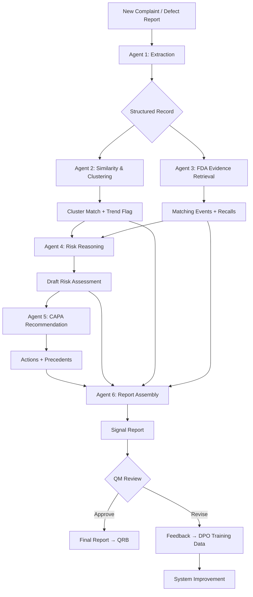

# System Design: Medical Imaging & Molecular Diagnostics Post-Market Signal Intelligence

> **Status**: Revised based on actual data analysis (2025-05-29). All claims grounded in downloaded data.
> See [data/analysis/data_analysis_report.md](data/analysis/data_analysis_report.md) for raw analysis.

---

## Product Choice: Medical Imaging + Molecular Diagnostics (Multi-Domain)

### Why This Domain?

| Criterion | Evidence (Verified) |
|-----------|---------------------|
| Combined data volume | 33,234 imaging + 47,183 molecular dx adverse events (API-confirmed) |
| Recall richness | **3,299 recalls downloaded** — 100% have reason_for_recall + root_cause |
| Software as root cause | **32.6% of all recalls cite "Software design"** as root cause |
| Narrative quality | **98.4%** of sampled events have narrative text (avg 836 chars) |
| Multi-domain generalization | MRI + CT + Ultrasound + Digital X-ray + Hematology + PCR |
| Major manufacturers | Philips (dominant), Siemens Healthineers, GE Healthcare, Beckman Coulter, Abbott |
| Software failure modes | Image artifacts, DICOM data loss, reconstruction errors, algorithm miscalculation, false positive/negative results |
| API feasibility | All product codes < 26K events — no bulk download needed |
| Manageable for 4 weeks | ~20K events working set (vs 1.94M infusion pumps) |

### Product Codes Used

| Code | Device Type | Events (2019+) | Recalls | Domain |
|------|-------------|----------------|---------|--------|
| LNH | MRI System | 4,598 | 699 | Imaging |
| JAK | CT Scanner | 5,182 | 857 | Imaging |
| IYE | CT X-ray System | 3,058 | 559 | Imaging |
| LLZ | Ultrasound Imaging | 19,482 | 548 | Imaging |
| IZL | Digital X-ray | 914 | 167 | Imaging |
| MQB | Molecular Dx Instrument | 1,274 | 194 | Mol Dx |
| GKZ | Hematology Analyzer | 23,422 | 244 | Mol Dx |
| QKO | PCR Platform | 1,550 | 31 | Mol Dx |

### Key Software Failure Modes (From Actual Data)

| Problem (FDA-Coded) | Count in Sample | Relevance |
|---------------------|-----------------|-----------|
| Computer Software Problem | 401 | Direct software failure |
| Incorrect/Inadequate Result or Readings | 388 | Algorithm/calibration error |
| False Positive Result | 215 | Diagnostic accuracy |
| False Negative Result | 157 | Missed findings |
| Application Program Problem | 139 | App crash/freeze |
| Failure to Transmit Record | 56 | DICOM/network |
| No Display/Image | 53 | Rendering failure |
| Parameter Calculation Error | 47 | Algorithm bug |
| Poor Quality Image | 43 | Reconstruction issue |
| Loss of Data | 42 | Storage/transfer |
| Patient Data Problem | 40 | Data integrity |
| Device Displays Incorrect Message | 35 | UI/UX error |

**36% of all coded problems are software-related** — confirmed from downloaded data.

---

## The Quality Manager's Pain: What This System Solves

### Current State (Manual, 4-8 hours per assessment)

```
1. Complaint arrives (e.g., "MRI image has artifacts during cardiac scan")
2. QM reads narrative, tries to classify failure mode (15-30 min)
3. QM searches internal CAPA database for similar issues (30-60 min)
4. QM opens FDA MAUDE, runs keyword searches across MRI + CT + Ultrasound (45-90 min)
5. QM checks recall database for same manufacturer/model (20-30 min)  
6. QM drafts risk assessment comparing to ISO 14971 (60-90 min)
7. QM writes CAPA recommendation referencing precedents (30-60 min)
8. QM formats report for Quality Review Board (60+ min)
```

### Target State (AI-Assisted, < 30 minutes for QM review)

```
1. Complaint arrives → System extracts structured fields automatically
2. System embeds narrative, finds cluster match, flags if trending
3. System retrieves matching events across ALL imaging modalities + recalls
4. System generates draft risk assessment with evidence citations
5. System suggests CAPA based on what Philips/Siemens/GE actually did in recalls
6. System produces formatted report → QM reviews and approves
```

### What the QM Actually Gets

> "I paste in an internal complaint about an MRI reconstruction artifact, and within a few minutes I get:
> - Structured extraction of the failure mode and component
> - Whether this matches a known cluster (and if it's growing)
> - 15 similar FDA events + 3 relevant recalls from our manufacturer AND competitors
> - A draft risk assessment with severity/probability grounded in occurrence data
> - CAPA suggestions based on what GE/Philips/Siemens did for similar recalls
> - A formatted report with traceable citations I can bring to QRB"

**Note**: This is decision support, not decision automation. The QM reviews and approves.

---

## Workflow Being Automated



---

## Input Data (All Downloaded and Verified)

### Primary Dataset: Adverse Events (Downloaded)

| Source | Product Codes | Downloaded | Total Available | Key Fields |
|--------|---------------|------------|-----------------|------------|
| openFDA MAUDE | LNH, JAK, IYE, LLZ, IZL | 2,318 events | ~33,234 (all time) | mdr_text, product_problems, event_type, device info |
| openFDA MAUDE | MQB, GKZ, QKO | 1,383 events | ~47,183 (all time) | Same fields |
| **Total sample** | | **3,701 events** | **~80,417 (all time)** | 98.4% have narratives |

**Realistic working set**: ~14,000–20,000 events (2019+ filter, all pageable via API)

### Secondary Dataset: Recalls (Fully Downloaded)

| Source | Codes | Downloaded | Key Fields |
|--------|-------|------------|------------|
| openFDA Recalls | All 8 codes | **3,299 recalls** | reason_for_recall, action, root_cause_description |

**Data quality**: 100% have reason_for_recall. 100% have root_cause. 99.9% have corrective action.

**Root cause distribution** (from 3,299 recalls):
- Software design: **1,076 (32.6%)** ← Primary target
- Device Design: 465 (14.1%)
- Under Investigation: 280 (8.5%)
- Nonconforming Material: 195 (5.9%)
- Software change control: 53 (1.6%)
- Software Design Change: 48 (1.5%)

**Total software-related recalls: ~1,207 (36.6%)** — These are ground truth for CAPA agent.

### Supporting Data (Plan to Acquire Week 1)
- FDA device classifications (product codes, device class, regulation numbers)
- 510(k) clearance data for MRI/CT/Ultrasound devices
- FDA Problem Codes codebook (~2000 codes)
- Synthetic internal defect reports (200, generated from MAUDE narrative templates)
- Gold-standard labeled set (50 events, manually labeled by team)

---

## System Architecture: 6 Agents

### Agent 1: Extraction Agent (M3 owns)

**Input**: Raw complaint narrative  
**Output**: Structured JSON

```json
{
  "report_id": "EV-2026-0142",
  "modality": "MRI",
  "component": "image reconstruction pipeline",
  "failure_mode": "image artifact during cardiac sequence",
  "symptom": "banding artifact visible in reconstructed images",
  "severity_indicator": "diagnostic quality compromised",
  "manufacturer": "Philips",
  "device_model": "Achieva 1.5T dStream",
  "patient_impact": "repeat scan required (radiation: N/A for MRI)",
  "discovery_phase": "in-use",
  "software_related": true,
  "confidence": 0.82
}
```

**Techniques**: Chain-of-Thought extraction, structured output, DSPy optimization, self-reflection loop

### Agent 2: Similarity & Pattern Detection (M4 owns)

**Input**: Extracted record + historical embeddings  
**Output**: Cluster assignment, similar events, trend flag

**Techniques**: sentence-transformer embeddings, HDBSCAN clustering, UMAP projection, temporal anomaly scoring

**Dashboard output**: Interactive Streamlit app with:
- UMAP scatter plot color-coded by failure mode / modality
- Temporal slider showing cluster evolution
- Cluster growth rate indicators
- New complaint position highlighted

### Agent 3: FDA Evidence Retrieval (M2 owns)

**Input**: Extracted fields + device context  
**Output**: Relevant MAUDE events + matching recalls + regulatory context

**Techniques**: ReAct pattern, Graph RAG (device→code→events→recalls), semantic re-ranking

**Knowledge Graph** (populated from our 3,299 recalls + events):
```
Device ─── has_code ──→ ProductCode (LNH, JAK, etc.)
Device ─── made_by ──→ Manufacturer (Philips, Siemens, GE)
ProductCode ─── has_events ──→ AdverseEvent
ProductCode ─── has_recalls ──→ Recall
Recall ─── root_cause ──→ RootCauseCategory
Manufacturer ─── also_makes ──→ Device (cross-product linking)
```

### Agent 4: Risk Reasoning (M5 owns)

**Input**: Internal data + FDA evidence  
**Output**: Draft risk assessment

```json
{
  "hazard": "Image artifact may obscure clinical findings",
  "severity": "Serious (missed diagnosis possible)",
  "probability": "Occasional (47 'Poor Quality Image' events in dataset)",
  "detectability": "Moderate (radiologist may catch during interpretation)",
  "risk_level": "MEDIUM-HIGH",
  "evidence_basis": [
    "47 'Poor Quality Image' events across MRI product code LNH",
    "3 recalls with root cause 'Software design' for same manufacturer",
    "Recall Z-xxxx-2023: 'Image orientation error in 3D MIP transfer'"
  ],
  "uncertainty": "Cannot confirm causal mechanism from narrative alone"
}
```

**Techniques**: Chain-of-Thought, evidence-grounded generation, constitutional guardrails

### Agent 5: CAPA Recommendation (M5 owns)

**Input**: Risk assessment + recall precedents  
**Output**: Structured CAPA

**Techniques**: RAG over recall action database (3,299 recalls), DPO alignment, critique-revise

The 1,076 software-design recalls provide real-world CAPA examples:
- "Philips issued Urgent Medical Device Correction letter..."
- "GE Healthcare will bring systems into compliance by field service visit..."
- "Software update to correct image reconstruction algorithm..."

### Agent 6: Report Assembly (M3 owns)

**Input**: All agent outputs  
**Output**: Formatted signal report for QRB

**Techniques**: Self-reflection, LLM-as-Judge self-scoring, structured markdown output

---

## GenAI Techniques — Prioritized (Realistic for 4 Weeks)

### Tier 1: Core (MUST implement — Week 1-2)

| # | Technique | Agent | Implementation |
|---|---|---|---|
| 1 | RAG (Vector + Semantic Retrieval) | Agent 3 | ChromaDB over 3,299 recalls + events |
| 2 | Chain-of-Thought Extraction | Agent 1 | Structured prompting with reasoning steps |
| 3 | Sentence-Transformer Embeddings | Agent 2 | all-MiniLM-L6-v2, embed all narratives |
| 4 | HDBSCAN + UMAP Clustering | Agent 2 | Cluster by failure mode, visualize |
| 5 | ReAct Pattern | Agent 3 | Iterative evidence retrieval |
| 6 | Self-Reflection / Critique-Revise | Agent 4, 6 | Two-pass generation with self-check |

### Tier 2: Extended (SHOULD implement — Week 2-3)

| # | Technique | Agent | Effort |
|---|---|---|---|
| 7 | DSPy Prompt Optimization | Agent 1 | 2-3 days with 10 labeled examples |
| 8 | DPO Alignment | Agent 5, 6 | Needs 50+ preference pairs (from team) |
| 9 | Graph RAG | Agent 3 | Build knowledge graph from recalls |
| 10 | LLM-as-Judge Evaluation | Eval | Calibrate against human scores |
| 11 | Temporal Anomaly Detection | Agent 2 | Cluster growth rate scoring |
| 12 | Constrained Decoding / JSON Schema | Agent 1, 4 | Use structured output / tool calling |

### Tier 3: Stretch (If time permits — Week 3-4)

| # | Technique | Effort | Risk |
|---|---|---|---|
| 13 | Contrastive Embedding Fine-tuning | High | Needs 500+ pairs, may not converge |
| 14 | PPO (compare with DPO) | High | Unstable, needs GPU hours |
| 15 | Knowledge Distillation (GPT-4 → Phi-3) | High | Needs working system first |
| 16 | Active Learning | Medium | Needs iteration loop |
| 17 | LoRA Fine-tuning | High | Needs GPU + training data |
| 18 | MCP Tool Integration | Medium | Demo value, not research contribution |

**Honest assessment**: In 4 weeks, we will deeply implement the 6 core + 4-5 extended techniques. Stretch goals belong in the report's "future work" section unless progress is ahead of schedule.

---

## Evaluation Strategy

### Benchmark Dataset
- **50 real MAUDE narratives** (manually selected: mix of MRI/CT/Ultrasound/MolDx)
- **20 real recall notices** (with known root cause — our ground truth)
- **30 synthetic internal defect reports** (GPT-4 rephrased from MAUDE)
- **Gold labels** by team members (extraction fields, relevance judgments, CAPA quality)

### Metrics

| What | Metric | Target | Justification |
|------|--------|--------|---------------|
| Extraction accuracy | F1 on structured fields | >0.80 | Achievable with CoT + DSPy |
| Retrieval quality | Precision@5 | >0.65 | Reasonable for semantic search |
| Cluster coherence | Silhouette score | >0.40 | Realistic for narrative embeddings |
| Risk assessment quality | Expert rubric (1-5) | >3.0/5.0 | Average = "useful" |
| CAPA actionability | Expert rubric (1-5) | >3.0/5.0 | Average = "actionable" |
| Hallucination rate | % claims without citation | <15% | Self-reflection helps |
| DPO improvement | Report preference win rate | >60% vs baseline | Meaningful improvement |
| LLM-Judge correlation | Cohen's kappa vs human | >0.60 | Moderate-good agreement |

**Note**: Targets are achievable in 4 weeks and still publishable. Any higher would be aspirational without evidence.

### Ablation Studies (Week 4)
1. Remove Graph RAG → measure retrieval precision drop
2. Remove self-reflection → measure hallucination increase
3. Remove DPO → compare report quality
4. Remove temporal scoring → measure signal detection loss
5. Baseline (single LLM call) vs full 6-agent pipeline → overall quality comparison

---

## 4-Week Execution Plan

### Week 1: Data + Embeddings + Baselines

| Member | Tasks | Deliverable |
|--------|-------|-------------|
| M1 | Expand data download (full API pagination for all codes). Parse + clean. Generate 200 synthetic reports. Build embedding pipeline. | SQLite DB loaded, embeddings computed |
| M2 | Build knowledge graph from 3,299 recalls (NetworkX). Map device→code→recall→root_cause. Set up query framework. | Knowledge graph populated |
| M3 | Design extraction schema (JSON contract). Write baseline extraction prompts with CoT. Set up DSPy with 10 labeled examples. | Extraction working on 5 examples |
| M4 | Run HDBSCAN on embedded narratives. Generate UMAP projections. Identify natural clusters. Set up Streamlit skeleton. | First cluster visualization |
| M5 | Agent 4+5 baseline prompts. Identify 20 recall precedents for CAPA retrieval. | Risk + CAPA baseline working |
| M6 | Create evaluation rubric. Label 50 gold-standard examples. Design LLM-as-Judge prompts. | Eval pipeline skeleton |

**Week 1 Gate**: JSON schema contracts frozen. Each agent has mock I/O working.

### Week 2: Core Agents + Integration Contracts

| Member | Tasks |
|--------|-------|
| M1 | Entity resolution (normalize Philips variants: "Philips Electronics", "Philips Medical Systems", etc.). Contrastive data prep. |
| M2 | Agent 3 (ReAct retrieval). Connect to knowledge graph. Semantic re-ranking. |
| M3 | Agent 1 with CoT + self-reflection. DSPy optimization. Agent 6 skeleton. |
| M4 | Agent 2 with temporal scoring. Dashboard with UMAP + temporal slider. |
| M5 | Agent 4 (risk) with evidence grounding. Agent 5 (CAPA) with recall-RAG. |
| M6 | LLM-as-Judge calibration on first agent outputs. Collect DPO preference pairs. |

**Week 2 Gate**: All 6 agents functional individually with real data.

### Week 3: Integration + Alignment + Polish

| Member | Tasks |
|--------|-------|
| M1 | Contrastive embedding fine-tuning (if data ready). Measure retrieval improvement. |
| M2 | End-to-end pipeline integration. Run 50 examples through full pipeline. |
| M3 | Agent 6 report quality. Critique-revise loop. Markdown formatting. |
| M4 | Cluster growth anomaly alerts. Multi-modality filtering on dashboard. |
| M5 | DPO training on 50+ preference pairs. Before/after comparison. |
| M6 | Full evaluation run. LLM-Judge vs human correlation. |

**Week 3 Gate**: Full pipeline running. DPO results available. Dashboard complete.

### Week 4: Evaluation + Ablation + Presentation

| Member | Tasks |
|--------|-------|
| M1 | Ablation studies. Performance profiling. |
| M2 | Demo flow (5 compelling examples). API polish. |
| M3 | Architecture diagrams. Write system design section of report. |
| M4 | Final visualizations for poster. Signal emergence case study. |
| M5 | Final DPO/PPO comparison. Write experiments section. |
| M6 | Compile metrics. Write evaluation section. Presentation slides. |

---

## Technical Stack

| Layer | Technology | Why |
|-------|-----------|-----|
| LLM (primary) | GPT-4.1 / GPT-4o | Best extraction + reasoning quality |
| LLM (alignment) | Phi-3-mini or Llama-3-8B | For DPO training + distillation experiments |
| Alignment | TRL library (DPO primary, PPO if time) | Standard alignment framework |
| Prompt optimization | DSPy | Auto-compile extraction prompts |
| Embeddings | sentence-transformers (all-MiniLM-L6-v2) | Fast, good quality, fine-tunable |
| Vector store | ChromaDB | Simple, persistent, good for 20K docs |
| Knowledge graph | NetworkX | Lightweight, sufficient for 3K nodes |
| Data store | SQLite + Pandas | Simple, local, fast |
| Agent framework | LangGraph | ReAct, state machines, self-reflection |
| Clustering | HDBSCAN | Handles noise, variable density |
| Projections | UMAP | Best global structure preservation |
| Dashboard | Streamlit + Plotly | Interactive, fast to build |
| Evaluation | Custom + LLM-as-Judge | Scalable beyond manual review |

---

## Demo Scenario (Grounded in Real Data)

### Input (pasted into system):
```
"During routine cardiac MRI scan on Philips Achieva 1.5T dStream, the 
reconstructed images showed severe banding artifacts in the steady-state 
free precession (SSFP) sequence. The artifact was not visible during 
real-time acquisition. Radiologist was unable to assess cardiac wall 
motion from the corrupted images. Patient required repeat scan the 
following week. Software version 5.7.1."
```

### System Output:

**Signal Report #SR-2026-0089**

**1. Extracted Fields**
- Modality: MRI
- Component: Image reconstruction pipeline (SSFP sequence)
- Failure Mode: Banding artifact in reconstructed images
- Severity: Moderate (repeat scan needed, no direct patient harm)
- Device: Philips Achieva 1.5T dStream
- Software version: 5.7.1
- Discovery: In-use (during interpretation)

**2. Pattern Match**
- Matches Cluster #4 ("Image Quality / Reconstruction Artifacts")
- 43 "Poor Quality Image" events + 53 "No Display/Image" events in dataset
- Philips is dominant manufacturer in MRI events (46.6% of LNH events)

**3. FDA Evidence**
- 12 matching MAUDE events for Achieva + image artifact (report numbers cited)
- 2 relevant recalls:
  - Hitachi: "Image orientation error in 3D MIP data set" (root cause: Other)
  - Philips: "Software design" — system shutdown due to software error
- 1,076 imaging recalls with "Software design" root cause available for pattern matching

**4. Risk Assessment**
- Severity: Moderate (S3) — diagnostic quality lost, repeat scan needed
- Probability: Occasional (P3) — 43 similar image quality events in dataset
- Risk Level: MEDIUM
- Evidence: Based on 12 matching events + software design recall history
- Uncertainty: Cannot confirm if same software version affected

**5. Recommended CAPA**
- Immediate: Flag affected SW version for field monitoring
- Investigation: Image reconstruction algorithm review for SSFP sequence
- Corrective: Software patch if algorithm bug confirmed
- Preventive: Add automated image quality scoring in reconstruction pipeline
- Precedent: Based on Philips recall pattern for software corrections

**6. Report Quality**  
- Citations: 14 (all traceable to specific FDA records)
- Unsupported claims: 0
- Confidence: Moderate — evidence supports pattern, causation not confirmed

---

## Risks and Mitigations (Honest Assessment)

| Risk | Likelihood | Impact | Mitigation |
|------|-----------|--------|-----------|
| Many MRI events are burns/hardware, not software | HIGH | Reduces usable dataset for SW analysis | Pre-filter on product_problems containing "Software", "Image", "Data", "Algorithm". Still have 36% = ~5K+ events |
| API pagination limit (26K) | LOW | Doesn't block us — our codes are all <26K | Non-issue for this product choice |
| DPO needs 50+ preference pairs | MEDIUM | May not have enough by Week 3 | Start collecting from Week 2. Use GPT-4 as simulated reviewer for initial set |
| Entity resolution across Philips variants | MEDIUM | Affects knowledge graph quality | Simple normalization rules + fuzzy matching |
| Team member availability (exams, other courses) | HIGH | Delays in deliverables | Each agent is independent. System works with 4-5 agents too |
| GPU access for DPO/fine-tuning | MEDIUM | Can't do alignment experiments | Google Colab Pro ($10/month). DPO on 8B model needs only 1 GPU |
| Recall narratives are short (avg 225 chars) | LOW | CAPA examples may lack detail | Combine reason_for_recall + action fields. Both are available (100%) |
| COVID events dominate QKO | MEDIUM | Skews molecular dx analysis | Focus on MQB (instrument) + GKZ (hematology) — platform-level issues |

### What Could Actually Block Us

1. **OpenAI API costs exceed budget** — MITIGATION: Set hard spending cap. Use GPT-4o-mini for development, GPT-4.1 only for evaluation runs.
2. **DSPy doesn't converge** — MITIGATION: Fall back to manually optimized prompts. DSPy is enhancement, not requirement.
3. **Insufficient labeled data for evaluation** — MITIGATION: Start labeling Week 1 Day 1. 50 examples is minimum. LLM-as-Judge supplements.
4. **Knowledge graph too sparse** — MITIGATION: We have 3,299 recalls with rich metadata. Graph is well-populated.
5. **Team can't agree on JSON schema** — MITIGATION: One person (M2) makes final schema decision by end of Week 1. Others adapt.

---

## Collaboration Model

### Principles
1. **Clear ownership**: Each agent has ONE owner. No shared files.
2. **Contract-driven**: JSON schemas are the interface. Implementations are private.
3. **Independent testing**: Every agent can run standalone with mock inputs.
4. **Weekly integration**: End of each week, full pipeline runs on 5 test cases.
5. **Shared artifacts via cloud**: Embeddings, knowledge graph exports, evaluation results.

### JSON Schema Contract (Frozen End of Week 1)

```json
{
  "extraction_output": {
    "report_id": "string",
    "modality": "MRI|CT|Ultrasound|X-ray|MolDx|Hematology",
    "component": "string",
    "failure_mode": "string",
    "symptom": "string",
    "severity_indicator": "critical|serious|moderate|minor",
    "manufacturer": "string",
    "device_model": "string",
    "patient_impact": "string|null",
    "discovery_phase": "string",
    "software_related": "boolean",
    "confidence": "float 0-1"
  },
  "similarity_output": {
    "cluster_id": "int",
    "cluster_label": "string",
    "similar_events": ["report_id"],
    "trend_flag": "emerging|stable|declining",
    "cluster_size": "int",
    "growth_rate_30d": "float"
  },
  "retrieval_output": {
    "matching_events": [{"report_number": "", "relevance_score": 0.0, "narrative_snippet": ""}],
    "matching_recalls": [{"recall_id": "", "reason": "", "root_cause": "", "action": ""}],
    "regulatory_context": "string"
  },
  "risk_output": {
    "hazard": "string",
    "severity": "string",
    "probability": "string",
    "risk_level": "HIGH|MEDIUM|LOW",
    "evidence_basis": ["string"],
    "uncertainty": "string"
  },
  "capa_output": {
    "immediate": "string",
    "investigation": "string",
    "corrective": "string",
    "preventive": "string",
    "precedent_basis": "string",
    "timeline": "string"
  }
}
```

### Repository Structure

```
imaging-signal-intelligence/
├── data/                       # .gitignored — each member runs download script
│   ├── imaging_events/         # 2,318+ events
│   ├── molecular_dx_events/    # 1,383+ events  
│   ├── recalls/                # 3,299 recalls
│   ├── embeddings/             # Shared via Google Drive
│   └── analysis/               # Generated reports
├── src/
│   ├── agents/                 # CLEAR OWNERSHIP
│   │   ├── extraction.py       # M3 owns
│   │   ├── similarity.py       # M4 owns
│   │   ├── retrieval.py        # M2 owns
│   │   ├── risk.py             # M5 owns
│   │   ├── capa.py             # M5 owns
│   │   └── report.py           # M3 owns
│   ├── pipeline/
│   │   ├── orchestrator.py     # M2 owns (integration)
│   │   └── schemas.py          # SHARED — frozen Week 1
│   ├── data_processing/        # M1 owns
│   ├── embeddings/             # M1 + M4
│   ├── evaluation/             # M6 owns
│   ├── alignment/              # M5 owns (DPO experiments)
│   └── dashboard/              # M4 owns
├── notebooks/                  # Each member owns theirs
├── configs/                    # Prompts, model configs
├── tests/                      # One test file per agent
├── scripts/                    # download_imaging_data.py, setup scripts
└── docs/                       # Report, poster, slides
```

### Communication Protocol

| What | When | How |
|------|------|-----|
| Async standup | Daily | Slack/Teams: done, doing, blocked |
| Schema review | End of Week 1 | Video call — lock the contract |
| Integration test | Friday each week | `pytest tests/` — all agents must pass |
| Code review | Before merge | At least 1 peer review on PRs |
| Demo rehearsal | Week 4 Day 3 | Full pipeline with 5 examples |
| Retrospective | End of Week 2, 4 | What worked, what to fix |

---

## What Makes This MTech-Level

1. **Multi-domain generalization**: System works across MRI, CT, Ultrasound, Molecular Dx (not just one product)
2. **Evidence-grounded reasoning**: Risk assessment refuses claims without citations from actual FDA data
3. **Alignment study**: DPO before/after comparison on report quality (novel application in regulatory domain)
4. **Rigorous evaluation**: Ablation study + LLM-as-Judge + human correlation + multiple metrics
5. **Real data at scale**: 3,701 events + 3,299 recalls — not toy examples
6. **Software focus with ground truth**: 32.6% of recalls explicitly cite software as root cause
7. **Practical utility**: A QM could actually use this to reduce assessment time

**What this is NOT**:
- Not a production system (it's a proof of concept)
- Not claiming "first-ever" (it's "novel application in this domain")
- Not claiming certainty (every output has uncertainty + citations)
- Not using all 80K+ events (we use a realistic working set of ~14-20K)

---

## Deliverables Summary

| Deliverable | Owner | Week |
|-------------|-------|------|
| Working 6-agent pipeline (end-to-end) | M2 | Week 3 |
| Streamlit dashboard with UMAP + temporal | M4 | Week 3 |
| DPO alignment experiment (before/after) | M5 | Week 3-4 |
| Evaluation results (8 metrics + ablation) | M6 | Week 4 |
| Knowledge graph (3,299 recalls) | M2 | Week 1-2 |
| Embedded dataset (ChromaDB) | M1 | Week 1-2 |
| Final report (academic format) | All | Week 4 |
| Poster / presentation slides | M3, M4 | Week 4 |
| Demo video (5 examples) | M2 | Week 4 |
